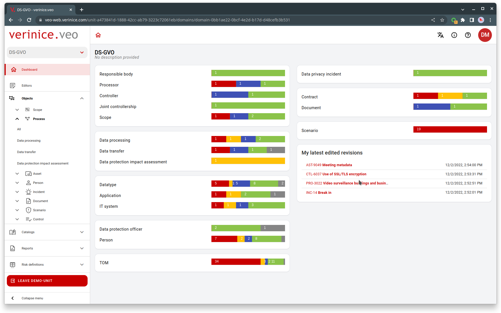

# verinice.veo

verinice.veo is a cloud-native application for managing information security and data protection.




## Build

### Prerequisite:
* Install Java 17.
* If you are using an IDE (Eclipse, IntelliJ, VSCode,...) you need to run it with the lombok compile time preprocessor. Simply download lombok.jar (i.e. from Maven Central) and run the helper: "java -jar lombok.jar". This will add the required parameter to your eclipse.ini or other configuration.  If you want to do it by hand, add the following parameter at the end of your eclipse.ini:

```
-javaagent:/home/user/eclipse/lombok.jar
```


### Clone project:

```bash
git clone https://github.com/SerNet/verinice-veo.git
cd verinice-veo
```

### Build project:

```bash
export JAVA_HOME=/path/to/jdk-17
./gradlew build [-x test]
```

## Build docker image:
If you want to build a Docker image, you can then run

```bash
docker build --build-arg VEO_VERSION='1.2.3-SNAPSHOT'
```

## Configuration
You can configure the application by changing properties either as system environment variables,
Java system property or by setting the properties in an application.properties file. Which
means the following are equivalent:

-	System Environment:

	```bash
	export spring_datasource_url=jdbc:postgresql://127.0.0.1:5432/veo
	java -jar ./veo-rest/build/libs/veo-rest-VERSION.jar
	```

-	Java system property value:

	```base
	java -Dspring.datasource.url=jdbc:postgresql://127.0.0.1:5432/veo -jar ./veo-rest/build/libs/veo-rest-VERSION.jar
	```

-	Adding the line to application.properties:

	```base
	spring.datasource.url=jdbc:postgresql://127.0.0.1:5432/veo
	```

The system environment variable approach has the advantage, that it works when running the built jar.

**Note** The system environment variable name is the same as the name of the property except
dots are replaced by underscore, i.e.

The following sections describe commonly changed properties.

### Database
The database connection can be modified by setting the following properties as needed:

```bash
export spring_datasource_url=jdbc:postgresql://127.0.0.1:5432/veo
export spring_datasource_username=veo
export spring_datasource_password=veo
```

### Profiles

Spring profiles can be used to tailor the appication for different runtime and deployment environments.
Profiles can be activated via the command line on launch:

```bash
./gradlew -P springProfiles=stats veo-rest:bootRun
or
java -Dspring.profiles.active=stats,local -jar veo-rest/build/libs/veo-rest-VERSION.jar
```

Profiles can also be set using environment variables:

```bash
SPRING_PROFILES_ACTIVE: stats,local
```

For more information on how to use profiles see [the reference documentation](https://docs.spring.io/spring-framework/docs/current/reference/html/core.html#beans-definition-profiles)

The following profiles are supported by the application:

#### Profile 'test'
This profile is active when unit or integration tests are running. It can be used to deactivate certain beans
and configurations that should not be running during tests because they are replaced by mocks/stubs or because
they are not required.

#### Profile 'stats'
This profile enables a data source proxy that logs all generated SQL. It can be used for debugging. It is
also used for tests that analyze the generated SQL queries for possible performance issues.

#### Profile 'background-tasks'
This profile should not be enabled for clustered (autoscaled) instances.
It activates background tasks that only need to be run once in each environment.
It will enable the following background tasks:

* an event-dispatcher that forwards the generated application events to an external AMQP
message broker.  The dispatcher needs to be configured using the corresponding settings found in `application.yaml`.

#### Profile 'local'
(Or any other self-defined profile name). Loads additional configuration files that can be used to set up
a dev environment, increase log levels and such. This profile will look for and load an additional property
file called `application-local.[yaml|properties]`

#### Profile 'resttest'
This profile will be active while the integration test for the REST API are running. These tests use Spring's `TestRestTemplate`
which needs to be configured with URLs and credentials for the production services that are to be used
during the integration test, such as Keycloak, PostgreSQL or RabbitMQ.

If you want to run the REST API integration tests, simply run:

```shell
./gradlew veo-rest:restTest
```

You can use `application-resttest.yaml` or your own `application-local.yaml` to set the required
parameters.

If you need to pass proxy parameters (i.e. if the backend server has to use a proxy to reach the
Keycloak service to verify access tokens) you can pass them on the command line as project properties:

```shell
./gradlew veo-rest:restTest \
-Phttp.proxyHost=cache.myhost.com -Phttp.proxyPort=3128 \
-Phttps.proxyHost=cache.myhost.com -Phttps.proxyPort=3128
```

The REST API tests will spin up a local server. All tests execute purely as HTTP requests
against this server. No address space is shared between REST client and server. It is not
possible to access repositories or any other server-side objects from the tests directly.
All communication has to occur using HTTP calls like a regular client would use the service.

#### Profile 'development'
This profile is active in the dev environment only.

### Logging

#### Change the Logging Level
You can change the logging level per package by setting the property `logging.level.<qualified package name>`, e.g.

```bash
export logging_level_org_veo_rest_security=DEBUG
export logging_level_org_veo=TRACE
```

Note that you have to replace the dots in the package name with underscores.

This even works for specific test runs:

```bash
env 'logging_level_org_veo=DEBUG' ./gradlew veo-rest:test --tests 'AuthenticationMockMvcITSpec'
```

Valid logging levels in ascending order are

- `ALL`
- `TRACE`
- `DEBUG`
- `INFO`
- `WARN`
- `ERROR`
- `FATAL`
- `OFF`

#### Log to Files
You can log to files by setting the property `logging.file`, e.g.

```bash
export logging_file=/var/log/veo.log
```

Of course if you want to see the logs and pipe them to a file you can always run

```bash
./gradlew sR | tee /var/log/veo.log
```

This also works for specific test runs:

```bash
env 'logging_file=/tmp/test.log' 'logging_level_org_veo=DEBUG' ./gradlew veo-rest:test --tests 'AuthenticationMockMvcITSpec'
```

#### Change logging configurations at runtime
To configure more complex setups you can reference a *logback.xml* configuration file, by setting
the property `logging.config`

```bash
export logging_config=/etc/veo/logback.xml
```

When you do so, you may like to enable configuration auto scanning by setting
the `scanPeriod` attribute of the `configuration` tag.

e.g. you could change the logging level in the following *logback.xml* from `error` to `debug`
while the application is running:

```xml
<?xml version="1.0" encoding="UTF-8"?>
<configuration scan="true" scanPeriod="30 seconds" >
	<include
		resource="org/springframework/boot/logging/logback/base.xml" />
	<logger name="org.veo" level="error" />
</configuration>
```

#### References
- [Spring 'How-to' guides: Logging](https://docs.spring.io/spring-boot/docs/1.5.x/reference/html/howto-logging.html)
- [Spring boot profile specific logging example](https://howtodoinjava.com/spring-boot2/logging/profile-specific-logging/)
- [Logback AutoScan](http://logback.qos.ch/manual/configuration.html#autoScan)

## Run

### Prerequisite:
* Install Java 17.
* Install PostgreSQL
* Create an empty database _v2020_

### Run REST Service

Set your database properties in file _veo-rest/src/main/resources/application.properties_ and rebuild the application.


```bash
./gradlew veo-rest:bootRun
```

or

```bash
./gradlew veo-rest:jar
java -jar veo-rest/build/libs/veo-rest-VERSION.jar
```

### Run jMeter GUI

./gradlew jmGui

### Run jMeter test

./gradlew jmRun


### Access Swagger-UI

[Swagger-UI](https://swagger.io/tools/swagger-ui/) can be accessed online at [api.verinice.com/veo](https://api.verinice.com/veo/swagger-ui/index.html) or after the REST service has been started locally at:

```
http://localhost:8070/swagger-ui.html
```

CAUTION: this URL will redirect you to `http://localhost:8070/swagger-ui/index.html?configUrl=/v3/api-docs/swagger-config`. Do **NOT** use this URL directly or the redirects for OpenID Connect authentication will not work.

### Access with Postman

You can use [postman](https://www.postman.com/) to access and test the REST API. To set up the necessary OAuth 2.0 authentication, got to the tab 'Authorization -> Configure New Token'.

Enter the following details:


Use the following values:

- Token Name: Can be freely set
- Callback URL: `https://api.verinice.com`
- Authorize using browser: _disabled_
- Auth URL: `https://auth.verinice.com/auth/realms/verinice-veo/protocol/openid-connect/auth`
- Access Token URL: `https://auth.verinice.com/auth/realms/verinice-veo/protocol/openid-connect/token`
- Client ID: `veo-prod`
- Client Secret: _empty_
- Scope: `veo-user`
- State: _empty_
- Client Authentication: `Send client credentials in body`

Click on 'Get New Access Token'. Enter your credentials. Then select the acquired token in the dropdown box 'Available Tokens'.

You can now send your HTTP request. The access token will time out (usually after 1-5 minutes) nad has to be requested again for another request.

## Modules

### veo-rest
This module contains the implementation of the REST services of the REST API.

## Authentication and Authorization

veo-rest uses OIDC to authorize users. To get an access token and access the API you can use any library supporting oAuth2. To test on the command line you can also use the script

	misc/scripts/authenticate

to log in and get an access token and

	misc/scripts/authorize

to use the access token and send a HTTP request to the API. See misc/scripts/README or
call `./misc/scripts/authenticate -h` for more details.

(See the section on using postman for another alternative.)


## Events

VEO records changes to entities and publishes them to an external message broker (see Profile 'background-tasks').

### Rules for event consumers

Veo uses a local event store to save model changes and corresponding events in the same transaction boundary. This ensures transactional consistency between events and model changes without the use of the XA protocol (two-phase commits). Please note: in rare cases an event may be published multiple times. This can happen if the message broker crashes after sending the event but before confirming the transmission to the publisher. Therefore:

- consumers of veo-events MUST perform message deduplication for all received events. Each event carries a unique ID that may be used for this purpose.
- Due to how those events are handled internally, gaps may occur in the IDs, so consumers MUST NOT rely on event IDs being consecutive.


## Code Styles
Code styles are enforced using the gradle plugins
[pmd](https://docs.gradle.org/current/userguide/pmd_plugin.html) and
[spotless](https://github.com/diffplug/spotless).

To verify your code run

	./gradlew pmdMain
	./gradlew spotlessCheck

or just

	./gradlew check

You can find formatting settings for IDEs in [misc/eclipse](misc/eclipse).

Spotless can fix code formatting violations by running

	./gradlew spotlessApply

For some reason the `ktlint` plugin cannot apply fixes. To automatically format Kotlin files
you can install [`ktlint`](https://ktlint.github.io/#getting-started) and run

	ktlint -F

In the project root.

Sample git hooks are provided in [misc/git](misc/git), e.g.
[pre-commit](misc/git/pre-commit), which checks the code style on each commit.
To install, copy the file to *.git/hooks/pre-commit*, etc. Make sure the
scripts are executable.

## Database migrations
Veo uses [flyway](https://github.com/flyway/flyway/) for DB migrations. It runs groovy migration scripts from [org.veo.persistence migrations](veo-persistence/src/main/groovy/org/veo/persistence/migrations) when starting the service / spring test environment before JPA is initialized.

### Creating a migration
1. Modify DB model code (persistence-layer entity classes).
2. `./gradlew bootRun`. The service might complain that the DB doesn't match the model but will silently generate the update DDL in `veo-rest/schema.local.sql`.
3. Copy SQL from `veo-rest/schema.local.sql`.
4. Create a new migration script (e.g. `veo-persistence/src/main/groovy/org/veo/persistence/migrations/V3__add_fancy_new_columns.groovy`) and let it execute the SQL you copied (see existing migration scripts).
5. Append a semicolon to every SQL command
6. Add some DML to your migration if necessary.
