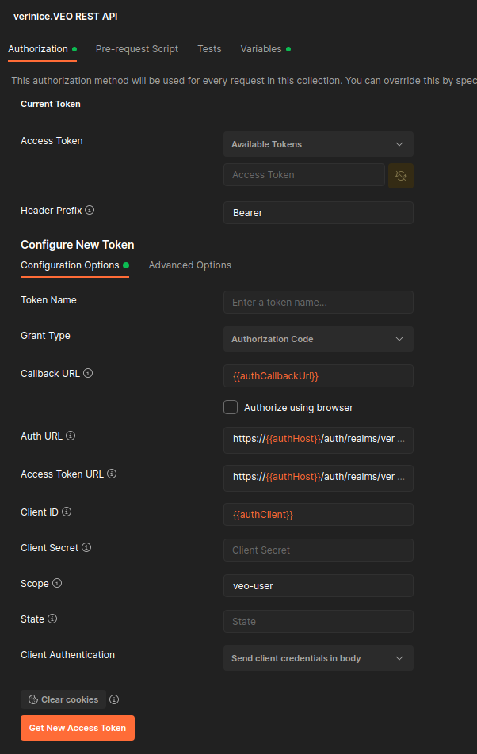

# verinice veo

A prototype of a new verinice version.

## Build

### Prerequisite:
* Install Java 11.
* If you are using an IDE (Eclipse, IntelliJ, VSCode,...) you need to run it with the lombok compile time preprocessor. Simply download lombok.jar (i.e. from Maven Central) and run the helper: "java -jar lombok.jar". This will add the required parameter to your eclipse.ini or other configuration.  If you want to do it by hand, add the following parameter at the end of your eclipse.ini:

```
-javaagent:/home/user/eclipse/lombok.jar
```


### Clone project:

```bash
git clone ssh://git@git.verinice.org:7999/rd/v2020.git
cd v2020
```

### Build project:

```bash
export JAVA_HOME=/path/to/jdk-11
./gradlew build [-x test]
```

## Build docker image:
If you want to build a Docker image, you can then run

```bash
docker build --build-arg VEO_VERSON='0.1.0-SNAPSHOT' .
```

## Configuration
You can configure the application by changing properties either as system environment variables,
Java system property or by setting the properties in an application.properties file. Which
means the following are equivalent:

-	System Environment:

	```bash
	export spring_datasource_url=jdbc:postgresql://127.0.0.1:5432/v2020
	java -jar ./veo-rest/build/libs/veo-rest-0.1.0-SNAPSHOT.jar
	```

-	Java system property value:

	```base
	java -Dspring.datasource.url=jdbc:postgresql://127.0.0.1:5432/v2020 -jar ./veo-rest/build/libs/veo-rest-0.1.0-SNAPSHOT.jar
	```

-	Adding the line to application.properties:

	```base
	spring.datasource.url=jdbc:postgresql://127.0.0.1:5432/v2020
	```

The system environment variable approach has the advantage, that it works when running the built jar.

**Note** The system environment variable name is the same as the name of the property except
dots are replaced by underscore, i.e.

The following sections describe commonly changed properties.

### Database
The database connection can be modified by setting the following properties as needed:

```bash
export spring_datasource_url=jdbc:postgresql://127.0.0.1:5432/v2020
export spring_datasource_username=verinice
export spring_datasource_password=verinice
export spring_datasource_driver-class-name=org.postgresql.Driver
export spring_jpa_database-platform=org.hibernate.dialect.PostgreSQLDialect
```

### Logging

#### Change the Logging Level
You can change the logging level per package by setting the property `logging.level.<qualified package name>`, e.g.

```bash
export logging_level_org_veo_rest_security=DEBUG
export logging_level_org_veo=TRACE
```

Note that you have to replace the dots in the package name with underscores.

This even works for specific test runs:

```bash
env 'logging_level_org_veo=DEBUG' ./gradlew veo-rest:test --tests 'AuthenticationMockMvcITSpec'
```

Valid logging levels in ascending order are

- `ALL`
- `TRACE`
- `DEBUG`
- `INFO`
- `WARN`
- `ERROR`
- `FATAL`
- `OFF`

#### Log to Files
You can log to files by setting the property `logging.file`, e.g.

```bash
export logging_file=/var/log/veo.log
```

Of course if you want to see the logs and pipe them to a file you can always run

```bash
./gradlew sR | tee /var/log/veo.log
```

This also works for specific test runs:

```bash
env 'logging_file=/tmp/test.log' 'logging_level_org_veo=DEBUG' ./gradlew veo-rest:test --tests 'AuthenticationMockMvcITSpec'
```

#### Change logging configurations at runtime
To configure more complex setups you can reference a *logback.xml* configuration file, by setting
the property `logging.config`

```bash
export logging_config=/etc/veo/logback.xml
```

When you do so, you may like to enable configuration auto scanning by setting
the `scanPeriod` attribute of the `configuration` tag.

e.g. you could change the logging level in the following *logback.xml* from `error` to `debug`
while the application is running:

```xml
<?xml version="1.0" encoding="UTF-8"?>
<configuration scan="true" scanPeriod="30 seconds" >
	<include
		resource="org/springframework/boot/logging/logback/base.xml" />
	<logger name="org.veo" level="error" />
</configuration>
```

#### References
- [Spring 'How-to' guides: Logging](https://docs.spring.io/spring-boot/docs/1.5.x/reference/html/howto-logging.html)
- [Spring boot profile specific logging example](https://howtodoinjava.com/spring-boot2/logging/profile-specific-logging/)
- [Logback AutoScan](http://logback.qos.ch/manual/configuration.html#autoScan)

## Run

### Prerequisite:
* Install Java 11.
* Install MySQL, MariaDB or PostgreSQL
* Create an empty database _v2020_

### Run VNA Import

Set your database properties in file _veo-vna-import/src/main/resources/application.properties_ and rebuild the application.

```bash
./gradlew veo-vna-import:bootJar
java -jar veo-vna-import/build/libs/veo-vna-import-0.1.0-SNAPSHOT.jar \
-f /path/to/verinice-archive-file.vna
```

### Run REST Service

Set your database properties in file _veo-rest/src/main/resources/application.properties_ and rebuild the application.


```bash
./gradlew veo-rest:bootRun
```

or

```bash
./gradlew veo-rest:jar
java -jar veo-rest/build/libs/veo-rest-0.1.0-SNAPSHOT.jar
```

### Run jMeter GUI

./gradlew jmGui

### Run jMeter test

./gradlew jmRun


### Access Swagger-UI

The Swagger-UI is available after strarting the REST service at:

```
http://localhost:8070/swagger-ui.html
```

CAUTION: this URL will redirect you to `http://localhost:8070/swagger-ui/index.html?configUrl=/v3/api-docs/swagger-config`. Do **NOT** use this URL directly or the redirects for OpenID Connect authentication will not work.

### Access with Postman

You can use [postman](https://www.postman.com/) to access and test the REST API. To set up the necessary authentication, got to the tab 'Authoization -> Get new access token'.

Enter the following details:



Use the following values:

* Auth URL: https://\<KEYCLOAK_SERVER\>/auth/realms/\<REALM\>/protocol/openid-connect/auth
* Access Token URL: https://\<KEYCLOAK_SERVER\>/auth/realms/\<REALM\>/protocol/openid-connect/token

Click on 'Request Token'. Enter your credentials. Then select the aquired token in the dropdown box 'Available Tokens'.

You can now send your HTTP request. The access token will time out (usually after 1-5 minutes) nad has to be requested again for another request.

## Modules

### veo-data-xml [DEPRECATED]
This module contains the JAXB class files for accessing SNCA.xml from verinice.

### veo-rest
This module contains the implementation of the REST services of the REST API.

The JSON schemas accepted by the API can be found in *${veo.basedir}/schemas/*. If this directory
does not exist, built-in schema files will be served as default.

*veo.basedir* can be set in *application.properties* and is */var/lib/veo* by
default. The gradle task `bootRun` sets *veo.basedir* to
*$HOME/.local/share/veo*.

### veo-vna-import [DEPRECATED]
This module contains an importer for verinice archives (VNAs). It has to be fixed to work with the new data model.

## Database [DEPRECATED]
Entity–relationship model of the database:


## Authentication and Authorization

veo-rest uses OIDC to authorize users. To get an access token and access the API you can use any library supporting oAuth2. To test on the command line you can also use the script

	misc/scripts/authenticate

to log in and get an access token and

	misc/scripts/authorize

to use the access token and send a HTTP request to the API. See misc/scripts/README or
call `./misc/scripts/authenticate -h` for more details.

(See the section on using postman for another alternative.)


## Code Styles
Code styles are enforced using the gradle plugins
[pmd](https://docs.gradle.org/current/userguide/pmd_plugin.html) and
[spotless](https://github.com/diffplug/spotless).

To verify your code run

	./gradlew pmdMain
	./gradlew spotlessCheck

or just

	./gradlew check

You can find formatting settings for IDEs in [misc/eclipse](misc/eclipse).

Sample git hooks are provided in [misc/git](misc/git), e.g.
[pre-commit](misc/git/pre-commit), which checks the code style on each commit.
To install, copy the file to *.git/hooks/pre-commit*, etc. Make sure the
scripts are executable.
